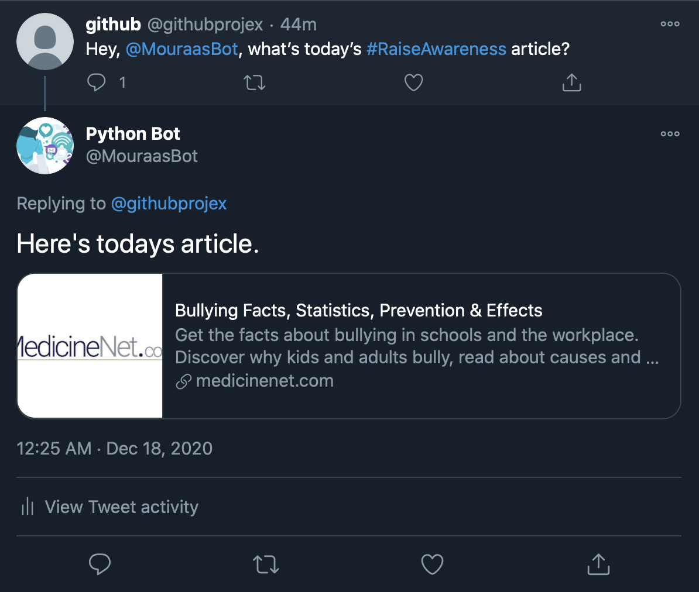
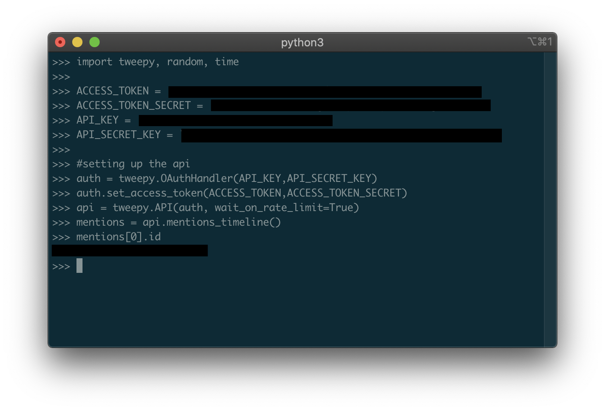

# The Goal 
If i'm going to use one of the biggest platforms on the planet, might as well go above and beyond. The aim of this project is to raise awareness with critical issues that we as humanity are currently facing. The first step in fixing a problem is to acknowledge that there is one, and this is where the project steps in.

Anytime you tweet at the person (whose keys you entered in the code) using #RaiseAwareness, a random article (from the list) describing an issue will be replied back to you. This is just an introductory article, so I urge you to continue researching the topic if it interests you!

## Try it yourself!
I set up an account by the name of @MouraasBot. Simply tweet at me using the #RaiseAwareness and see the magic happen. (Please allow a couple of moments as the script is being run on the cloud and I have a sleep method attatched.) 

## Prerequisites

` pip install tweepy ` 

` twitter developer account `

## Secret Keys
To use this script, you will need four different keys, all provided by twitter when you register your account as a developer. If you refresh those keys, you will have to update your code's keys accordingly.  

## ID File
Please follow these steps closely as it is how you will retrieve the latest tweet id to enter in your id file. 

- Open up your terminal, type 'python3' and hit enter.
- Copy and paste lines 1 - 11 and press enter. 
- Copy the following code into the terminal: 'mentions = api.mentions_timeline()' and hit enter
- Copy the following code into the terminal: 'mentions[0].id' and hit enter. You will receive the most recent tweet's id. 
- Copy and paste that number in the id_file.

It should look like this:

## Notice

If you want to automatically run the script, even while your computer/terminal is closed, you will have to place all the files on a python cloud service such as pythonanywhere, or even on your own server.
